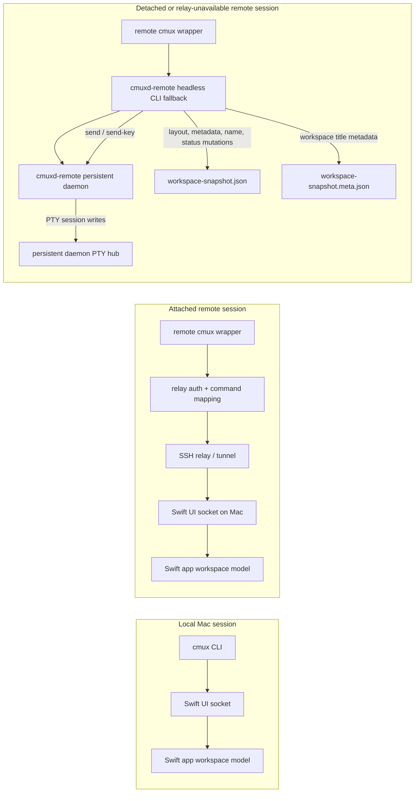
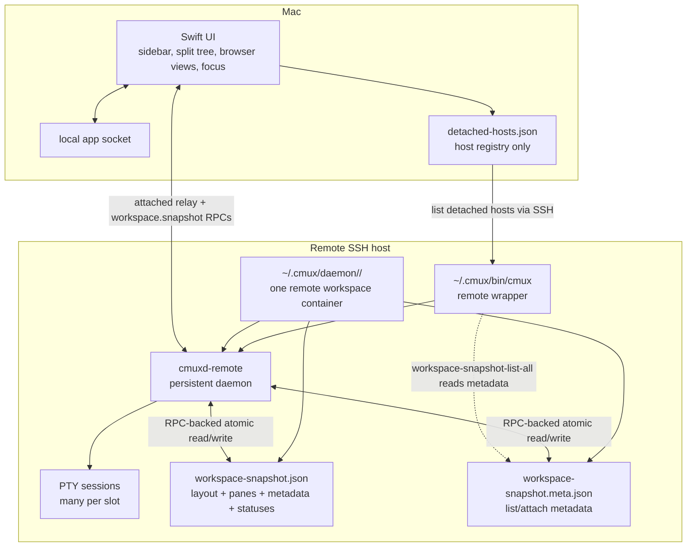
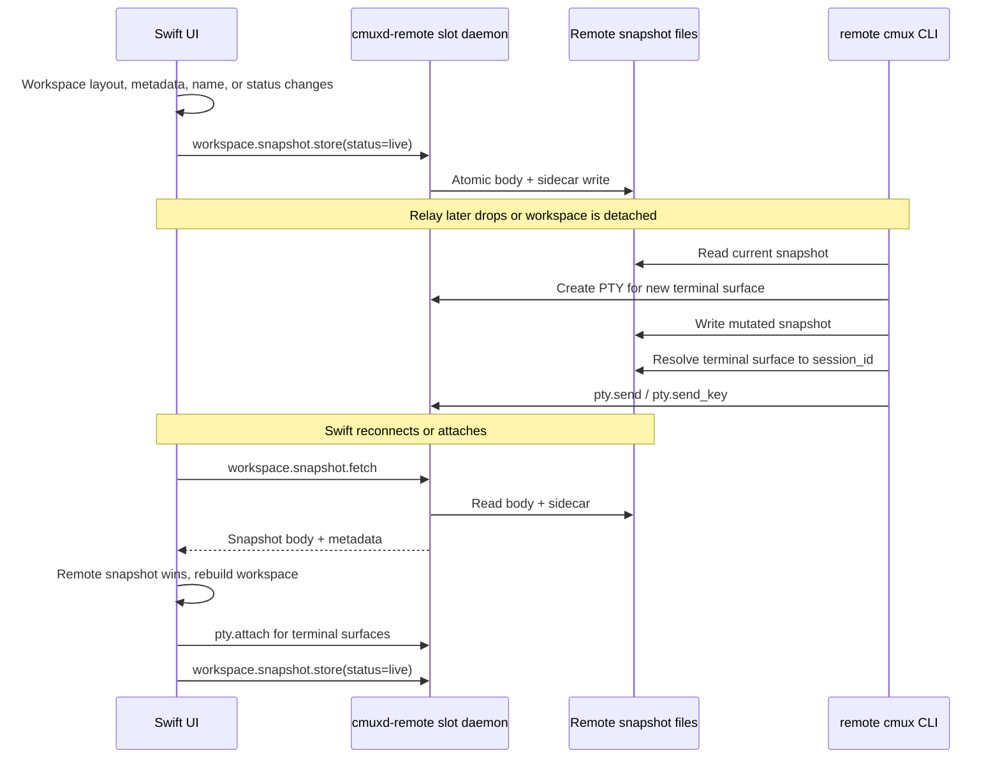
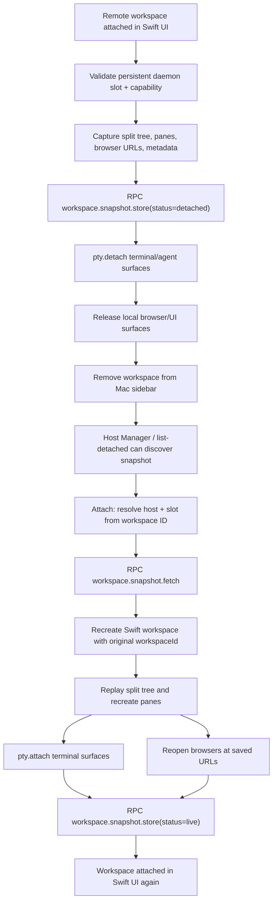

# cmux Remote Workspace Capabilities for Craft

Source branch:

```text
https://github.com/edbordin-linktree/cmux/tree/local/remote-workspace-snapshots
```

This branch combines two layers:

- an unmerged upstream remote-session base from `manaflow-ai/cmux#4807` that runs a persistent `cmuxd-remote` daemon on the SSH host;
- local additions on this branch that snapshot and restore workspace layout around that daemon.

## General Model

The remote host does not run the full cmux workspace UI. The Swift app on the Mac still owns the real workspace model while attached: sidebar entries, split layout, tabs, browser surfaces, focus, and most workspace commands are Swift/UI state.

The remote host owns long-lived terminal processes. The base branch from PR `manaflow-ai/cmux#4807` adds a persistent `cmuxd-remote` daemon under `~/.cmux/daemon/<slot>/`. That daemon keeps PTY sessions alive and exposes primitives such as `pty.attach` and `pty.detach`, so a terminal process can survive the Mac UI closing its surface or losing the relay.

This branch builds a workspace illusion on top of that PTY layer:

- while attached, Swift periodically writes a workspace snapshot to the remote daemon slot;
- when the user detaches, Swift stores a final `detached` snapshot, detaches terminal surfaces from their PTYs, releases local browser/UI surfaces, and removes the workspace from the Mac sidebar;
- while detached or disconnected, scripts on the remote host can perform a restricted set of mutations against that snapshot, including metadata, layout, names, and status banners;
- while detached or disconnected, scripts can also send input to known terminal surfaces through authenticated daemon PTY-session RPCs;
- when the user attaches or reconnects, Swift fetches the remote snapshot, rebuilds the workspace UI locally, and reattaches terminal surfaces to the still-running remote PTYs.

So the workspace appears to be maintained on the server, but that is mostly a snapshot/recreate mechanism. Terminal process state is genuinely server-side because the daemon owns the PTYs. Browser state, split-tree rendering, sidebar presence, focus, and most UI behavior are reconstructed by the Mac app from the saved snapshot.

The snapshot layer intentionally keeps browser recovery shallow: browser surfaces reopen at the saved URL, but WKWebView cookies, scroll position, back/forward state, devtools, and local data stores are not part of the remote snapshot.

### Daemon Slot Semantics

A persistent daemon slot is not one PTY. It is the server-side container for one remote workspace instance.

In practice, each `cmux ssh ...` remote workspace gets a unique slot such as `ssh-f605ac69-bcc0-406f-8d88-6c2a9220879e`. That slot corresponds to:

- one daemon directory: `~/.cmux/daemon/<slot>/`;
- one persistent `cmuxd-remote serve --persistent-server --slot <slot>` daemon;
- one workspace snapshot body and metadata sidecar;
- many PTY sessions, one per terminal/agent surface in that workspace.

PTYs are identified separately by `session_id` values, usually derived from workspace and surface IDs. New terminal surfaces created while attached or detached create additional PTYs inside the same slot. Attach reuses the original slot so Swift can fetch the snapshot and reconnect each terminal surface to its PTY.

## Current Branch Additions

This branch adds detached remote workspace snapshots, hidden workspace metadata, snapshot-backed workspace status banners, a Host Manager UI, and a restricted remote-headless command path for scripts running on an SSH host.

The core behavior Craft should rely on is:

- A remote workspace can be detached from the Mac UI while its layout snapshot and PTYs remain on the remote host.
- The Mac can list detached workspaces and attach them later.
- Swift stores, fetches, and clears a specific workspace snapshot through the per-slot `cmuxd-remote` daemon RPCs.
- Detached workspace discovery uses a one-shot `cmuxd-remote workspace-snapshot-list-all --json` command over SSH, not ad hoc shell filesystem commands.
- A `cmux` command running inside a remote cmux terminal first tries the normal relay back to the Swift UI.
- If the relay is unavailable, that remote `cmux` command can operate on the local remote snapshot for a restricted set of commands.
- Detached `cmux send` and `cmux send-key` resolve a terminal surface from the snapshot, then call authenticated daemon PTY-session RPCs; they do not create temporary attachments.
- Detached workspace/tab rename commands and status-banner commands mutate the remote snapshot directly, so the restored Swift UI reflects the remote-side state.
- On reconnect/attach, the remote snapshot wins and Swift rebuilds local layout from it.

## Architecture Diagrams

### CLI Command Paths



### Remote Daemon and Snapshot Layers



### Checkpoint and Reconnect Flow



### Detach and Attach Flow



## Current cmux Capabilities

### Local Mac Commands

These commands are intended for the Mac-side cmux app/CLI:

```bash
cmux ssh-workspace-detach --workspace <workspace> [--json]
cmux ssh-workspace-list-detached [--host <host>] [--json] [--timeout <secs>]
cmux ssh-workspace-attach --workspace-id <uuid> [--host <host>] [--slot <slot>] [--json]
cmux ssh-workspace-snapshot-clear (--workspace-id <uuid> | --host <host> --slot <slot>) [--force]
cmux ssh-host-list [--json]
cmux ssh-host-forget --host <host> [--force]
```

`ssh-workspace-list-detached` only shows snapshots whose remote metadata status is `detached`. Attached/reconnected workspaces keep a `live` checkpoint snapshot on the remote host, but those are intentionally hidden from detached listings.

### Workspace Metadata

Hidden metadata is stored with the workspace and is included in remote snapshots. It is not rendered in the sidebar.

```bash
cmux metadata set --workspace <workspace> <key> <value>
cmux metadata set --workspace <workspace> <key> --value-json <json>
cmux metadata get --workspace <workspace> <key> --json
cmux metadata list --workspace <workspace> [--prefix <prefix>] --json
cmux metadata clear --workspace <workspace> <key>
```

Metadata is persisted in:

- local session persistence;
- `RemoteWorkspaceSnapshotV1.metadataEntries`;
- remote snapshot store/fetch round trips;
- detached remote snapshot mutations.

Visible status banners are separate from hidden metadata. They are persisted in `RemoteWorkspaceSnapshotV1.statusEntries` and are restored after the workspace session snapshot is replayed.

### Metadata Lookup

Workspace lookup can use hidden metadata instead of title prefixes:

```bash
cmux workspace lookup \
  --metadata craft:project-id=<id> \
  --metadata craft:task-id=<id> \
  --include-detached \
  --json
```

Attached workspaces are searched first. With `--include-detached`, cmux also searches detached remote snapshots discovered from the host registry.

### Remote-Headless Commands

Inside a remote cmux terminal, the injected `cmux` wrapper has:

```text
CMUX_WORKSPACE_ID
CMUX_TAB_ID
CMUX_SURFACE_ID
CMUX_PANEL_ID
CMUX_REMOTE_DAEMON_SLOT
CMUX_SOCKET_PATH
PATH=$HOME/.cmux/bin:$PATH
```

When the Mac relay is gone, these commands fall back to mutating or reading the remote snapshot directly:

```bash
cmux metadata set|get|list|clear --workspace current ...
cmux workspace lookup --metadata <key=value> [--include-detached] --json
cmux tree --workspace current --json
cmux new-pane --workspace current --type terminal|browser [--direction <dir>] [--url <url>] [--command <cmd>] [--focus true|false]
cmux new-surface --workspace current --type terminal|browser [--pane <pane>] [--url <url>] [--command <cmd>] [--focus true|false]
cmux new-split <dir> --workspace current [--surface <surface>] [--type terminal|browser] [--url <url>] [--command <cmd>] [--focus true|false]
cmux close-surface --workspace current --surface <surface>
cmux rename-workspace [--workspace current] '<title>'
cmux rename-window [--workspace current] '<title>'
cmux rename-tab --surface <surface> '<title>'
cmux set-status <key> <value> [--icon <icon>] [--color <color>] [--priority <n>]
cmux clear-status <key>
cmux list-status
cmux send --surface <surface> -- '<text>'
cmux send-key --surface <surface> <key>
```

Terminal creation in detached mode starts a real PTY through the persistent daemon before writing the new terminal surface into the snapshot. Browser creation records the initial URL/title only.

Detached `send` / `send-key` only work for terminal or agent surfaces whose snapshot contains a `remotePTYSessionId`. They resolve the terminal surface from the snapshot and call the slot daemon directly:

```text
pty.write_session { session_id, data_base64 }
pty.send          { session_id, text }
pty.send_key      { session_id, key }
```

These RPCs require normal daemon auth and write to the PTY session input queue without creating a temporary attachment. `send-key` intentionally supports the common supervisor keys rather than a full keyboard model: `enter`, `tab`, `escape`, `backspace`, arrow keys, `home`, `end`, `delete`, `pageup`, `pagedown`, `space`, and `ctrl-<letter>` aliases including `ctrl-c`, `ctrl-d`, `ctrl-z`, and `ctrl-\`.

For supervisor scripts, prefer startup commands when creating new surfaces:

```bash
cmux new-pane --workspace current --type terminal --command '<command>'
cmux new-pane --workspace current --type browser --url '<url>'
```

Use `send` / `send-key` when the script intentionally needs to interact with an already-running terminal process.

`rename-workspace` and `rename-window` are aliases in this branch. In detached mode they update both the snapshot body title and the discovery sidecar title. `rename-tab` updates the saved pane title for terminal and browser surfaces; unsupported surface types return a clear error.

`set-status`, `clear-status`, and `list-status` keep using the Swift socket while the relay is available. When the relay is unavailable, they mutate or read `RemoteWorkspaceSnapshotV1.statusEntries` in the remote snapshot. Status entries are visible UI state, not hidden metadata: they are intended for banners/badges that should reappear when Swift attaches or reconnects.

### Attached-Only Commands

These still require an attached Swift UI:

- focus and selection commands;
- workspace/window movement;
- browser automation or navigation after browser creation;
- access to local Mac browser state such as cookies, scroll position, devtools, or WKWebView session data.

Craft should treat failures from these commands as operator-convenience failures, not supervisor-critical failures.

### Snapshot Reconciliation

Remote snapshots have a `status`:

- `detached`: workspace is not present in the Mac sidebar and is shown by Host Manager / `ssh-workspace-list-detached`;
- `live`: workspace is attached or reconnected; snapshot is a remote checkpoint and hidden from detached listings.

Detach writes a `detached` snapshot and removes the local workspace. Attach restores the workspace using the original `workspaceId`, preserving the UUID across detach/attach, then writes a `live` snapshot instead of clearing it.

When Swift reconnects to a workspace whose remote snapshot changed while detached or disconnected, the remote snapshot wins. Swift rebuilds local layout from the remote snapshot, reapplies snapshot-backed status banners, and validates PTYs during restore. Missing PTYs become lost placeholders.

### Validated E2E Behavior

The current branch was tested on `ed@tdb` with the dev build:

- created a remote workspace with multiple panes and browser/terminal surfaces;
- detached it from the Mac UI;
- ran remote `cmux` commands after forcing the Mac relay unavailable;
- set hidden metadata from the remote host;
- created a browser pane from the remote host;
- created a terminal pane from the remote host with `--command`;
- sent text and `ctrl-d` to a detached terminal PTY through the remote daemon without creating a temporary attachment;
- renamed the detached workspace and a terminal surface from the remote host;
- set/listed/cleared a detached status banner through the remote snapshot;
- reattached from the Mac;
- preserved the original workspace UUID;
- restored the remote-created terminal process and output;
- created another remote terminal after reattach.

## Craft Integration Plan

Craft should move cmux integration away from title-prefix conventions. The new cmux branch provides enough hidden metadata and detached-safe primitives for Craft to keep task workspaces controllable while the Mac UI is detached or temporarily disconnected. Visible status banners can still be used for operator feedback because they now survive detach/attach and can be set from a detached remote session.

### Workspace Identity

Use hidden metadata as the authoritative workspace identity.

Suggested keys:

```text
craft:schema-version=1
craft:project-id=<stable project slug/id>
craft:project-dir=<absolute project path>
craft:task-id=<task id>              # task workspaces only
craft:task-dir=<absolute task path>  # task workspaces only
```

Titles should be human-readable labels only. They can still include task names for the sidebar, but Craft should not use them for lookup.

Task workspace lookup:

```bash
cmux workspace lookup \
  --metadata craft:project-id="$project_id" \
  --metadata craft:task-id="$task_id" \
  --include-detached \
  --json
```

Project workspace lookup can search by `craft:project-id` and then let Craft filter out results that have `craft:task-id`. cmux does not need a dedicated `workspace.kind`.

When Craft creates a workspace, it should immediately write the identity metadata before creating secondary surfaces.

### Surface Identity

Craft should keep semantic surface references in hidden workspace metadata. cmux still owns opaque surface IDs.

Suggested metadata keys:

```text
craft:surface:agent
craft:surface:architect
craft:surface:orchestrator
craft:surface:dashboard
craft:surface:diffhub-review
craft:surface:github-pr
craft:surface:devin-session
craft:surface:buildkite-status
```

Suggested JSON value:

```json
{
  "surface_id": "surface-or-uuid",
  "type": "terminal",
  "purpose": "agent",
  "title": "task-123",
  "url": null,
  "agent": "claude",
  "updated_at": "2026-05-28T00:00:00Z"
}
```

For browser surfaces, set `"type": "browser"` and include `"url"`.

Craft owns the semantic meaning and retry/ensure policy. cmux only stores the JSON string and exposes `tree` for existence checks.

### Provider Refactor

Add a small cmux provider layer around JSON commands:

```bash
_cmux_workspace_lookup_by_metadata
_cmux_metadata_get
_cmux_metadata_set_json
_cmux_metadata_clear
_cmux_tree_json
_cmux_surface_exists
_cmux_surface_from_metadata
_cmux_record_surface
```

Then update current Craft helpers:

- `_mux_ws_ref`: replace title-prefix matching with metadata lookup.
- `_mux_ws_window`: keep as attached-only; do not make supervisor logic depend on it.
- `_mux_surface_by_tab_title`: replace with metadata lookup plus `tree` existence validation.
- `ensure_session`: create/refresh the project workspace, then write `craft:project-id` and `craft:project-dir`.
- `ensure_task_session`: create/refresh the task workspace, then write `craft:project-id`, `craft:task-id`, and `craft:task-dir`.
- `spawn_task_pane`: manage `craft:surface:agent`; create the terminal with `new-pane` or `new-split --type terminal --command "$cmd"` and then record the returned `surface_id`.
- `pane_is_running`: read `craft:surface:agent`, then verify the surface exists in `cmux tree`.
- `kill_task_pane`: close the recorded surface, then clear `craft:surface:agent`.
- `mux_spawn_named_pane`: replace visible `set-status craft:pane:<name>` with hidden `metadata set craft:surface:<name> --value-json ...`.
- `mux_send_to_pane`: send to the recorded terminal `surface_id`; this is detached-safe for terminal/agent surfaces only.
- `mux_pane_exists`: use hidden metadata plus `tree`.
- `mux_kill_named_pane`: close the recorded surface and clear the hidden metadata key.
- status/banner helpers: keep using `set-status`, `clear-status`, and `list-status` for visible operator feedback. Do not use status entries as identity or lookup state.

The existing discoverer-specific path should become a normal agent surface with different Craft-side configuration. cmux does not need special discoverer behavior.

### Detached-Safe Craft Operations

Craft supervisor scripts can rely on these in attached and detached remote workspaces:

- find a task workspace by metadata;
- read/write hidden metadata;
- inspect workspace tree;
- create terminal surfaces with startup commands;
- create browser surfaces with initial URLs;
- send text or common keys to known terminal/agent surfaces;
- close known surfaces.
- rename task workspaces and known terminal/browser surfaces;
- set, list, and clear visible status banners.

Craft should not require these for detached supervisor correctness:

- selecting or focusing a workspace/surface;
- moving workspaces between windows;
- browser automation after initial browser creation.

### Example Detached-Safe Supervisor Flow

```bash
workspace_json="$(cmux workspace lookup \
  --metadata craft:project-id="$project_id" \
  --metadata craft:task-id="$task_id" \
  --include-detached \
  --json)"

workspace_id="$(printf '%s' "$workspace_json" | jq -r '.matches[0].id')"

surface_json="$(cmux new-pane \
  --workspace "$workspace_id" \
  --type terminal \
  --direction down \
  --command "$agent_command" \
  --json)"

surface_id="$(printf '%s' "$surface_json" | jq -r '.surface_id // .surface_ref')"

cmux metadata set \
  --workspace "$workspace_id" \
  craft:surface:agent \
  --value-json "{\"surface_id\":\"$surface_id\",\"type\":\"terminal\",\"purpose\":\"agent\",\"agent\":\"$agent\",\"updated_at\":\"$(date -u +%Y-%m-%dT%H:%M:%SZ)\"}"
```

When running inside the remote workspace and the Mac relay is unavailable, the same commands operate on the remote snapshot.

## TODO: Concurrency Control

Add locking or lightweight compare-and-swap semantics for remote snapshot metadata and layout mutations after the concept is stable. Concurrent remote scripts should not be able to silently overwrite each other's metadata or layout changes long term.
